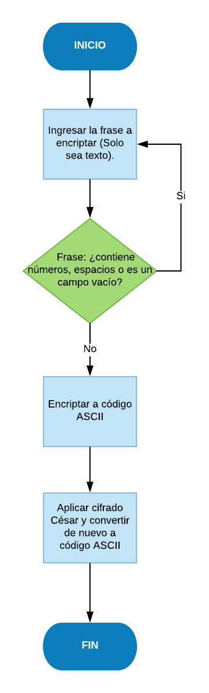

# Cifrado César

### Descripción
En este proyecto se presentará una página web donde se solicitará al usuario ingrese un texto que quiere será cifrado César, posteriormente dicho texto se le devolverá ya aplicando su nueva posición en el abecedario.

Se utilizarán dos funciones: **_cipher_** para encriptar el texto ingresado a código ASCII y **_decipher_** que utilizará a *cipher* para aplicarle el cifrado César y convertirlo nuevamente a código ASCII.

## Pseudocódigo
Este ejercicio se realizó siguiendo los siguientes pasos:

1. Utilizando un *prompt()* se pedirá al usuario ingrese una frase tipo "string" y con un bucle "Do..While" evitaremos que el usuario deje el campo vacío, con espacio o que contenga números en la frase.

2. Si el texto es correcto, mediante la función *cipher* convertiremos la frase inicial a código ASCII.

3. Con la función *decipher*, aplicaremos el cifrado César a cada caracter de la frase (desplazando 33 posiciones a la derecha del abecedario) y se convertirá este nuevo número a código ASCII.

## Diagrama de Flujo

### Descripción
En el website con el uso de un prompt se ingresará a una frase para cifrar César que será devuelto con otras letras, el texto se podrá ejecutar hasta que se corrija: no dejar campo vacío, colocar espacios o poner números.

Posteriormente usando la función *cypher* encriptaremos la frase en Código ASCII y finalmente devolveremos con la función *decypher* la frase ingresada ya con el cifrado César aplicado y su nueva posición según el código ASCII.

<!-- Comentario de prueba para imagen -->

